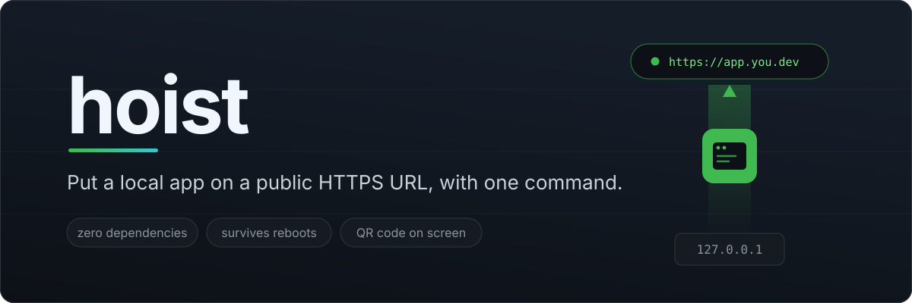
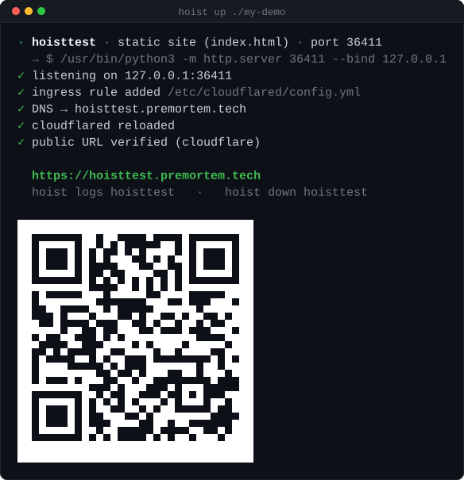
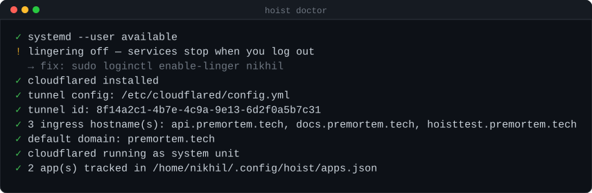
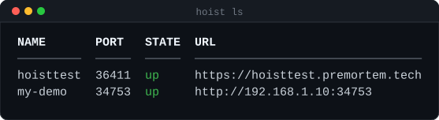
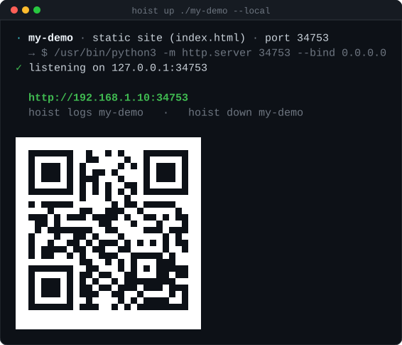
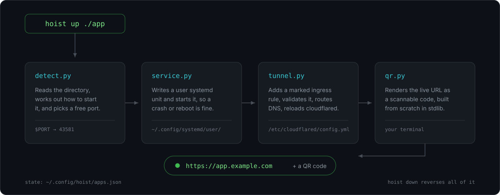

<p align="center">
  
  
  
  
</p>

<p align="center">
  
</p>

That's it. Your app is running as a managed service, it survives crashes and
reboots, it has a real certificate, and the QR code on screen puts it on a
judge's phone in about two seconds.

> Every screenshot here is a real run, rendered from the terminal output by
> [`scripts/make_docs_images.sh`](scripts/make_docs_images.sh). The QR codes in
> them scan.

## Why

Getting a local project onto a shareable URL is five fiddly steps that are
easy to get wrong under time pressure:

1. pick a port nothing else is using
2. write a systemd unit so it keeps running
3. add an ingress rule to your Cloudflare Tunnel config
4. create the DNS record
5. restart the tunnel, then find the URL again to share it

`hoist up` is those five steps. `hoist down` is their exact inverse.

## Install

```bash
pipx install hoist-cli        # or: pip install --user hoist-cli
```

Or straight from source, no packaging step:

```bash
git clone https://github.com/nikhilcherry/hoist
cd hoist && pip install -e .
```

**Zero runtime dependencies** — standard library only, including the QR
encoder. It works on a conference laptop with no internet.

Check your setup any time:

```bash
hoist doctor
```



`doctor` never changes anything. When something is off it prints the exact
command that fixes it.

## One-time setup: no password prompts

cloudflared does not watch its config file, so new ingress rules only take
effect on restart -- which is the only reason root is involved. If your
config is root-owned, sudo will prompt, and `hoist up` then has to run in a
real terminal rather than any wrapper that lacks a TTY.

To remove the prompt for good, run these once (`hoist doctor` prints them
with your paths filled in):

```bash
sudo chown $USER /etc/cloudflared/config.yml
echo "$USER ALL=(root) NOPASSWD: /usr/bin/systemctl restart cloudflared" | sudo tee /etc/sudoers.d/hoist
sudo chmod 440 /etc/sudoers.d/hoist
```

The sudoers rule is scoped to exactly one command -- restarting cloudflared --
not blanket root.

## A note on wildcard DNS

If your zone has a wildcard record (`*.example.com`), every hostname resolves
and returns *something*, so a half-finished publish looks like it worked --
you get someone else's 404 instead of an error. After reloading the tunnel,
hoist fetches the public URL and compares it against what your app serves
locally, and tells you when a different server answered.

## Requirements

- Linux with `systemd --user`
- [`cloudflared`](https://developers.cloudflare.com/cloudflare-one/connections/connect-networks/downloads/)
  with a tunnel already created, and a domain on Cloudflare
- Python 3.9+

Only want a LAN URL? Skip cloudflared entirely and use `--local`.

## Commands

| Command | What it does |
| --- | --- |
| `hoist up [dir]` | Run a project and publish it. Detects the start command. |
| `hoist share [dir]` | Serve a folder of files publicly. No project needed. |
| `hoist ls` | Every hoisted app, its port, health and URL. |
| `hoist down <name>` | Stop it and remove its ingress rule. |
| `hoist logs <name> [-f]` | Tail the app's journald logs. |
| `hoist restart <name>` | Restart the service. |
| `hoist url <name>` | Print the URL (pipe it into `xdg-open`, Slack, etc). |
| `hoist qr <name>` | Reprint the QR code. |
| `hoist adopt <name> --port N` | Publish something already running (Docker, `npm run dev`). |
| `hoist doctor` | Check systemd, cloudflared, tunnel, domain, permissions. |



### Useful flags

```bash
hoist up ./api --name api --port 8000        # pin the name and port
hoist up ./api --cmd 'uvicorn main:app --port $PORT'
hoist up ./api --env DATABASE_URL=postgres://localhost/dev
hoist up ./site --local                      # LAN URL + QR, no tunnel, no internet
hoist up ./site --domain example.com         # remembered for next time
```

## What it detects

| Found in the directory | Start command |
| --- | --- |
| `Procfile` with a `web:` line | that line |
| `package.json` | `npm start`, else `npm run dev` / `serve` / `preview` |
| `manage.py` | `python3 manage.py runserver 127.0.0.1:$PORT` |
| `app.py` / `main.py` / `server.py` / `wsgi.py` | `python3 <file>` |
| `Cargo.toml` | `cargo run --release` |
| `go.mod` | `go run .` |
| `index.html` or any `*.html` | `python3 -m http.server $PORT` |

Anything else: tell hoist how to start it with `--cmd`.

## Telling hoist how to start your app

`--cmd` is for when the table above has no row for your project, or the guess
it makes is wrong:

```bash
hoist up ./api --cmd 'uvicorn main:app --port $PORT'
```

### Rule 1: listen on the port hoist gives you

hoist picks a free port, then publishes *that* port. If your app ignores it
and listens on its own hardcoded port instead, hoist waits, then tells you
`nothing listening on port 43581` — your app is running perfectly well, just
somewhere nobody is looking. This is the one thing that has to be right.

There are two ways to get the number, and they are equivalent — use whichever
suits your app:

- **Write `$PORT` in the command.** hoist substitutes the real number before
  the app ever starts, so `--port $PORT` becomes `--port 43581`.
- **Read `PORT` from the environment.** hoist always sets it, so
  `process.env.PORT` in Node or `os.environ["PORT"]` in Python just works,
  and you can leave `$PORT` out of the command entirely.

### Rule 2: wrap it in single quotes

```bash
hoist up ./api --cmd 'uvicorn main:app --port $PORT'    # right
hoist up ./api --cmd "uvicorn main:app --port $PORT"    # wrong
```

With double quotes **your shell** expands `$PORT` before hoist ever sees it.
It is almost never set in your shell, so hoist receives `--port` followed by
nothing and the app dies with a confusing error. Single quotes pass the text
through untouched, which is what you want.

### Rule 3: don't background it

The command must run in the foreground and stay there — that is how systemd
knows your app is alive. Anything that forks and returns immediately makes
systemd think it exited:

```bash
--cmd 'npm start &'                  # no: the & backgrounds it
--cmd 'gunicorn app:app --daemon'    # no: --daemon forks
--cmd 'pm2 start server.js'          # no: pm2 is its own supervisor
```

Drop the `&`, the `--daemon`, the `pm2`. hoist is the supervisor.

### Recipes

| Stack | `--cmd` |
| --- | --- |
| Node / Express | `'node server.js'` — read `process.env.PORT` |
| Next.js | `'npx next dev -p $PORT'` |
| Vite | `'npm run dev -- --port $PORT'` |
| FastAPI | `'uvicorn main:app --port $PORT'` |
| Flask | `'flask run --port $PORT'` |
| Django | `'python3 manage.py runserver 127.0.0.1:$PORT'` |
| Gunicorn | `'gunicorn app:app --bind 127.0.0.1:$PORT'` |
| Streamlit | `'streamlit run app.py --server.port $PORT'` |
| Go | `'go run . --port $PORT'` |
| Rust | `'cargo run --release -- --port $PORT'` |
| A folder of files | `'python3 -m http.server $PORT'` |

### What else you get

- **It runs in the directory you hoisted**, so relative paths in the command
  and in your code behave as they do when you run it by hand.
- **Shell syntax works.** If the command contains `&&`, a pipe, a redirect or
  a glob, hoist runs it through `sh -lc` instead of executing it directly, so
  `--cmd 'npm run build && npm start'` is fine.
- **Version managers work.** If the binary isn't on your `PATH` when you run
  `hoist up`, the command is resolved by a login shell at start time instead,
  so things installed through nvm, pyenv or rustup are still found.
- **Extra environment variables** go in with `--env`, repeated as needed:
  `--env DATABASE_URL=postgres://localhost/dev --env DEBUG=1`.

### When it doesn't come up

You don't have to go looking. `hoist up` waits for the port to open, and if it
doesn't, it says which of the three ways it went wrong and prints the last few
lines the app logged before dying:

| What you see | What it usually means |
| --- | --- |
| `keeps crashing on startup` | the app exits as fast as it starts — a mistyped binary, a missing dependency, an import error. The tail says which. |
| `failed to start` | systemd couldn't run the command at all |
| `nothing listening on port N` | the app is running, on a *different* port. Rule 1. |

For more than the tail, `hoist logs <name> -f` follows the app's journald
output live. Nine times out of ten it is one of the three rules above: wrong
port, double quotes, or a command that backgrounded itself.

Already have the app running and only want it public? Skip `--cmd` entirely
and adopt the port it is already on:

```bash
hoist adopt api --port 8000
```

## Safety around your tunnel config

The cloudflared config is usually a live file with hand-written rules in it,
so hoist is deliberately careful:

- Every rule it adds is tagged with a `# hoist:<name>` marker, and it will
  only ever remove rules carrying its own marker.
- It **refuses** to touch a hostname you configured by hand.
- The config is edited as text, so your comments, ordering and indentation
  survive. `hoist down` restores the file byte-for-byte.
- Every write makes a timestamped backup first.
- After writing it runs `cloudflared tunnel ingress validate`, and rolls back
  to the backup if the config is rejected.
- The catch-all rule is always kept last, where cloudflared requires it.

`hoist down` intentionally leaves the DNS record in place: deleting DNS is
slow to undo, and reusing the same name later just works.

## Hackathon notes

- **Offline?** `--local` gives you a LAN URL and a QR code with no internet
  and no cloudflared. Everyone on the venue wifi can reach your demo.

  

- **Demo day.** `hoist qr <name>` fills the terminal with a code judges can
  scan while you talk. No "let me just find the link".
- **Webhooks.** Stripe, Twilio, GitHub and friends need a real HTTPS URL. A
  hoisted app gives you a stable one that survives laptop sleep.
- **Your laptop lid.** Services are `Restart=on-failure` and enabled, so they
  come back after a reboot. Run `sudo loginctl enable-linger $USER` once so
  they also survive logout — `hoist doctor` reminds you.

## How it works



State lives in `~/.config/hoist/apps.json`. Nothing is hidden anywhere else:
hoist only ever touches that file, its own systemd units, and the ingress
rules it marked.

## Development

```bash
pip install -e ".[dev]"
pytest -q
```

The QR encoder is written from scratch against the spec so the tool has no
dependencies. It is tested two ways: a golden matrix in the unit tests, and
`scripts/qr_conformance.py`, which renders codes to PNG and decodes them with
`zbarimg` in CI.

The screenshots in `docs/` are captured from real runs rather than drawn by
hand, so they cannot drift from what the tool actually prints:

```bash
scripts/make_docs_images.sh                  # the --local screenshots
scripts/make_docs_images.sh --public NAME    # also re-shoot the publish flow
```

`--public` performs a real publish, so pass a hostname you already use for
testing — it rewrites your cloudflared config and restarts the tunnel. The
script re-decodes every QR it renders with `zbarimg` at the end, and redacts
the tunnel id out of the `doctor` shot.

## License

MIT
